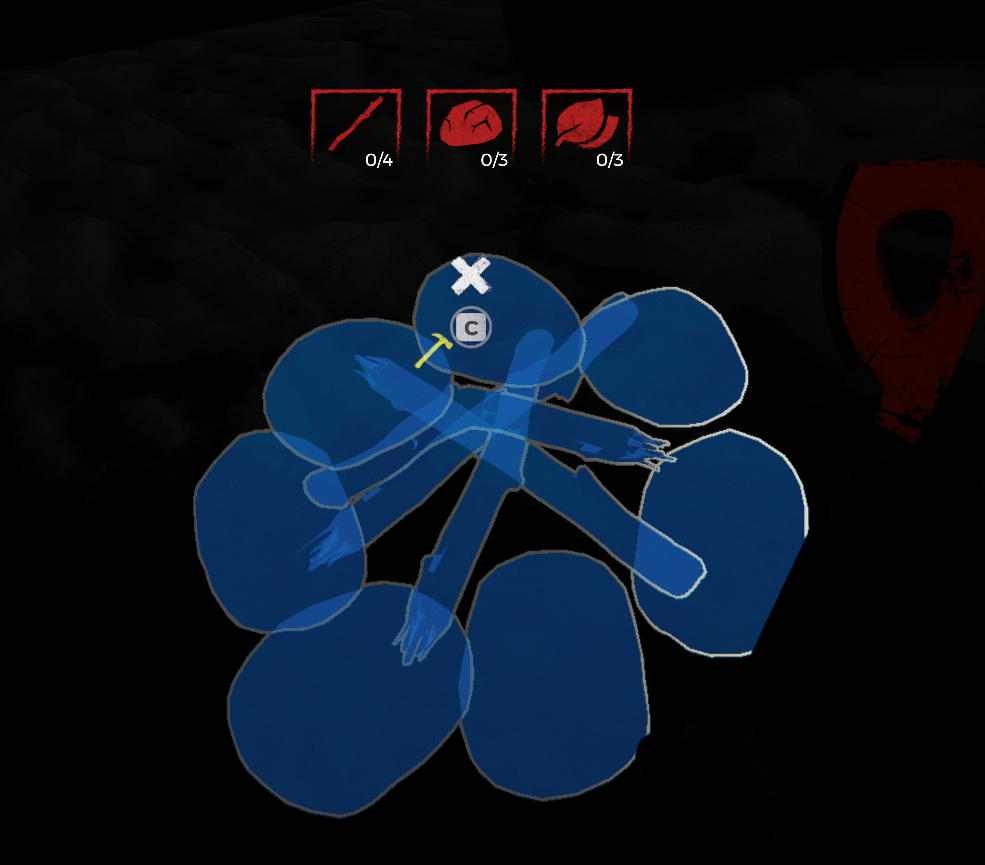
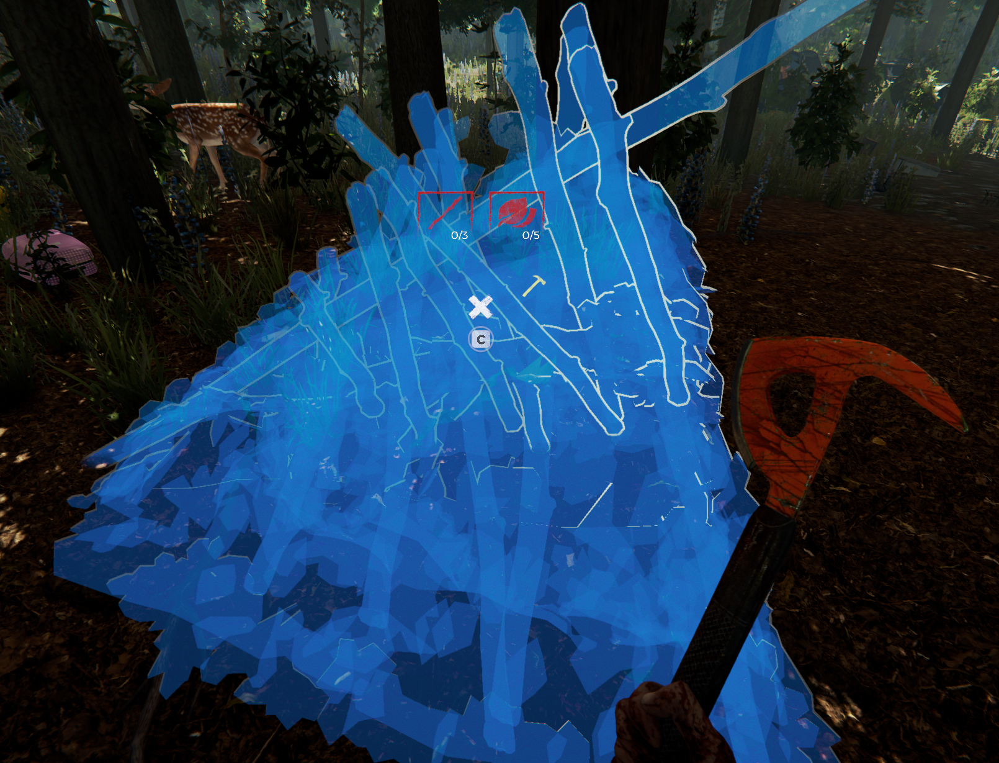
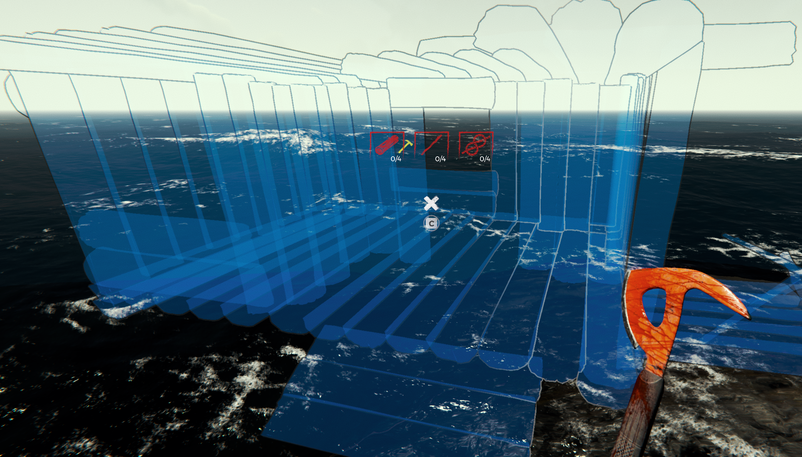
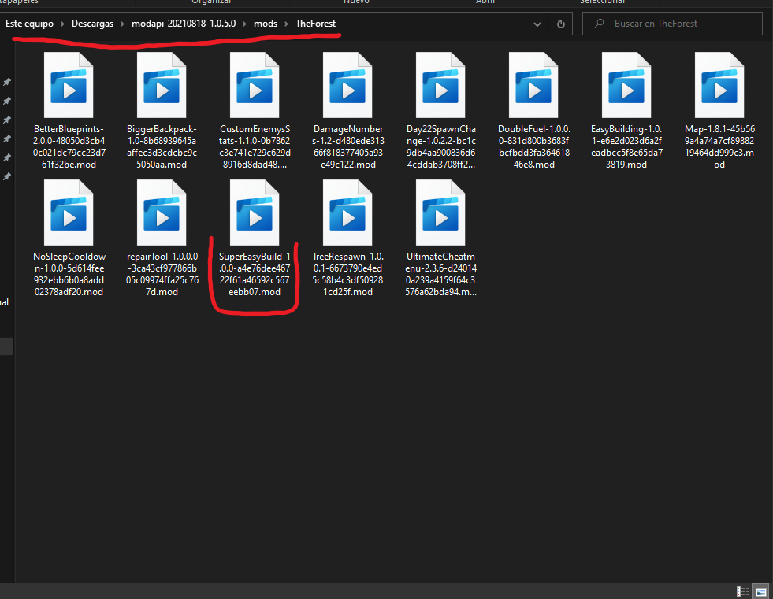


# The Forest - Super Easy Build [Compatible with 1.11b]

Greatly reduce the number of items for crafting.

Reduction is applied based on the required number of items in the recipe.

The mod is confirmed to work for The Forest 1.11b

## Acknowledgements

- [ModApi](https://modapi.survivetheforest.net/) for making modding possible
- [FluffyFishGames](https://github.com/FluffyFishGames/ModAPI-The-Forest-Mods)  for your amazing mods, I took a look to your code for examples and inspiration <3

## Features

Reduce the number of materials required for building.

The number is reduced based on the original recipe:
- Logs requirement is always reduced a 90%
- 40 or more, reduced a 85%
- less tan 40 and 5 or more, reduced a 60%
- less than 5, leave it as it is

Examples:

Tree house:
- Vanilla recipe: 35 logs, 1 rope
- Mod recipe: 4 logs, 1 rope

Leaf trap:
- Vanilla recipe: 50 leafs
- Mod recipe: 5 leafs

Rabbit trap:
- Vanilla recipe: 31 sticks
- Mod recipe: 12 sticks

Floating home:
- Vanilla recipe: 40 logs, 4 ropes, 4 sticks
- Mod recipe: 4 logs, 4 ropes, 4 sticks

Campfire:
- Vanilla recipe: 7 leafs, 5 sticks, 7 rocks
- Mod recipe: 3 leaf, 4 sticks, 3 rock

## Installation

### Requirements
- The Forest 1.11b
- [ModAPI 1.0.5+](https://modapi.survivetheforest.net)

### Install with ModAPI
If you already have ModAPI, go to the [mod page]()
1. Download the mod
2. Go to your ModAPI folder
3. Decompress and copy the content inside `mods/TheForest` folder

Something like:
- Your ModApi Folder
  - Mods
    -  TheForest
      - SuperEasyBuild

### Manual install
- You must have [BepInEx Subnautica Pack](https://www.nexusmods.com/subnautica/mods/1108) and [SMLHelper (Modding Helper)](https://www.nexusmods.com/subnautica/mods/113) installed.
- Extract the CyclopsSolarCharger archive into your BepInEx\plugins\ folder.

### Pack install
- Go to [ModAPI pack](https://modapi.survivetheforest.net/)
- In the 3rd step (Select popular mods) click on Load More button until you see SuperEasyBuild
- Select all the mods you want to install
- 
## License

[MIT](https://choosealicense.com/licenses/mit/)

